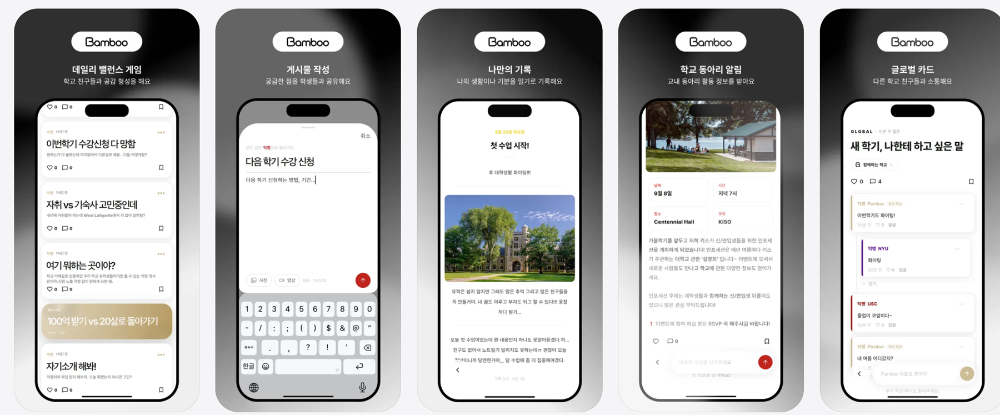
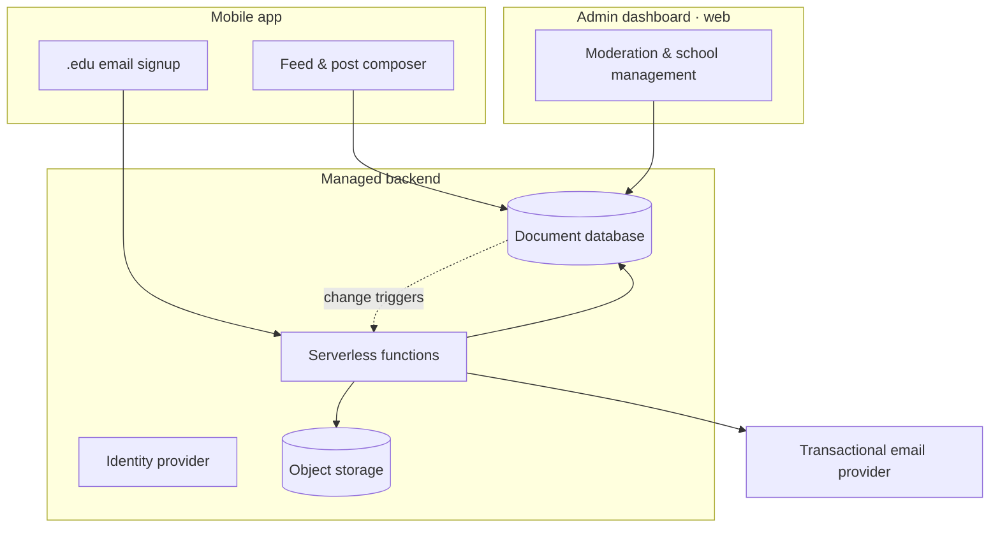

<p align="center">
  
</p>

<h1 align="center">Bamboo — Architecture Case Study</h1>

<p align="center">
  An anonymous campus community for international students in the U.S.<br>
  <a href="https://apps.apple.com/us/app/bamboo-campus-community/id6799337020"><b>Download on the App Store</b></a>
</p>



---

Bamboo is live on the App Store. Its application repository is private, so this document covers the part that can be shared: the problems the system had to solve and why it is built the way it is.

**Stack:** Flutter (iOS) · Firebase (Firestore, Auth, Cloud Functions, Storage, App Check) · Flutter Web admin dashboard

---

## The problem

International students arrive on an F-1 visa into a campus where they have no existing network. The practical questions — which dorm, how course registration actually works, whether a lease is a scam — get asked in group chats that scatter and disappear, or not asked at all, because asking them publicly costs face.

That produces a specific and slightly contradictory requirement:

- **Identity must be verified.** An anonymous forum with open signup fills with outsiders, and the value of the space is that everyone in it actually goes to your school.
- **Conversation must be anonymous.** The questions worth asking are the ones people will not attach their name to.

So the system verifies identity at the door and then deliberately forgets it in every post. Signup requires a `.edu` email; the address determines the campus and is never shown to anyone.

The first cohort is Korean international students, which is why the UI in the screenshots is Korean. The data model is campus-scoped from the start, so additional campuses and languages are new rows rather than a migration.

---

## System overview



Two apps share one codebase: the student mobile app and a web-only admin dashboard, built from separate entrypoints and deployed independently.

**Security rules are the authorization boundary, not app code.** UI-level gates are conveniences. Every access decision is expressed in the rules file and composed from helpers (`userDomain()`, `isVerified()`, `canAccessPost()`). Admins get a blanket allow at the bottom of the file — *except* for a carve-out list of sensitive collections (email verification records, password resets, rate limits, moderation log, private journals) that stay server-only even for admins.

**Multi-tenancy is derived, not stored as a foreign key.** A user's campus comes from their email domain. Content carries the same domain field and feeds filter on it — except posts flagged global, which intentionally bypass campus scoping for the weekly cross-campus feature.

---

## Design decisions

### 1. Preventing account enumeration in email verification

The signup flow sends a verification code to a `.edu` address. The naive version branches: if the email is already registered, return early; otherwise send a code. That leaks the user list — anyone can test addresses and learn who has an account.

Making the *response body* identical is not enough. Rate limiting reintroduces the leak through a side channel: if only registered addresses consume a quota, then calling the endpoint repeatedly returns 429 for registered emails and succeeds indefinitely for unregistered ones. The signal moves, it does not disappear.

So the rate-limit slot is reserved **before** the branch and regardless of registration status, and both paths perform exactly one outbound email round trip, so response timing does not split either:

```js
// This reservation succeeds regardless of whether the account exists.
// Skipping it for registered addresses would leak enumeration through
// "does calling repeatedly return 429?" even with identical response bodies.
const code = await reserveSendSlot(ref, now, quotaMessage);

// Only the message content differs. Both branches make one outbound send.
const mail = alreadyRegistered ? alreadyRegisteredMail : verificationCodeMail;
```

The rule that fell out of this: preventing enumeration means making *every observable behavior* identical — body, status, timing, and quota — not just the response text.

The reservation and the counter increment also had to move into a single transaction. Before that, concurrent requests each read the same count, each saw room, and all passed.

### 2. Notification aggregation through document IDs instead of cooldown logic

A post that gets 200 likes should not send its author 200 push notifications. The obvious fix is a cooldown timer, which means tracking last-sent state per user per post and reasoning about races.

Instead, likes write to a **deterministic document ID** — `like_{postId}_{6-hour bucket}` — with a merge write, and push is sent by the notification-created trigger:

- The first like in a bucket **creates** the document → the create trigger fires → one push.
- Every later like **updates** it → no create event → no push.

Suppression falls out of trigger semantics. There is no timer and no state to race on. The 6-hour bucket exists so that a like days later still notifies; pinning one document per post forever would mean the author never hears about that post again.

Two consequences worth stating, because both were deliberate:

- The aggregated document stores **no sender ID**. A single user ID standing in for many likers would cause that user's account deletion to sweep away notifications generated by other people. There is also no personal data left in the document to clean up — only a count.
- That count tracks *notification events*, not current likes, so it does not decrease when someone unlikes. It is a display number, not a source of truth.

Comment notifications stay one document per event: each carries its own preview text, and their volume is naturally bounded by the effort of writing a comment.

### 3. Counters are eventually consistent by design

Counter triggers are not idempotent. The event system delivers at-least-once, and event-triggered functions default to no retry — so a duplicate delivery double-counts, and a failed update under contention drops an increment permanently. Turning retry on trades one failure mode for the other. Neither setting is safe alone.

The resolution is to stop treating the trigger as authoritative:

1. Counter writes route through a wrapper that **swallows** the failure and logs it under a `[counter-drift]` marker — a failed like count must not also kill the notification write that follows it.
2. A scheduled job re-derives the true counts from the actual subcollections every 6 hours and overwrites them with **absolute values**.
3. The per-post repair runs inside a transaction that re-reads the counts, because an absolute write computed outside one erases anything that lands in the gap — precisely on the posts that drift in the first place.

### 4. Load testing the counter path — and being wrong about the ceiling

The database's sustained write limit is roughly one write per second per document. A popular post concentrates like, comment, and poll-vote counter writes onto that single document, and likes additionally hit the aggregate notification document — so the hot document is not one, it is two.

A load-test harness drives concurrent likes, comments, and votes at a single post and measures three distinct numbers, because "was anything lost?" is the wrong question when a reconcile job repairs losses anyway:

| Metric | What it means |
|---|---|
| **Final delta** | Difference remaining after everything settles — increments lost for good |
| **Peak visible drift** | The worst wrong number a user actually saw before it settled |
| **Time to settle** | How long that wrong number was on screen |

A final delta of 0 with a 26-second settle time is not a pass. It means nothing was lost *and* users watched a stale count for 26 seconds.

Results across four load steps against the production project (isolated on a reserved invalid domain):

| Step | Likes | Final delta | Peak drift | Settle | Throughput |
|---|---|---|---|---|---|
| 1 | 50 | 0 | 40 | 4.8s | 12.5/s |
| 2 | 200 | 0 | 160 | 8.2s | 29.2/s |
| 3 | 500 | 0 | 400 | 15.0s | 39.9/s |
| 4 | 1000 | 0 | 777 | 25.9s | 46.3/s |

No losses through 600 events on a single post. The first loss appeared at step 4 — one comment out of 500 (0.2%). Client write failures were zero across every run.

**The interesting part was the ceiling.** Throughput flattened at 46–49 events/sec across all three scenarios:

```
likes      12.5 → 29.2 → 39.9 → 46.3 /s
comments    5.7 → 16.9 → 32.0 → 48.5 /s
votes       7.1 → 20.5 → 37.7 → 49.5 /s
                          ^^^^^^^^^^ three different functions, same ceiling
```

The first explanation considered was the function instance cap: 10 instances × ~5 calls/sec each ≈ 50/sec, which matched the observation suspiciously well. **That arithmetic was wrong.** It assumes one instance handles one request at a time, which is not true for these functions — their deployed concurrency is 80 per instance. Checking the live container configuration instead of trusting the formula:

| Trigger | Concurrency | Max instances |
|---|---|---|
| Like created | 80 | 10 |
| Comment created | 80 | 10 |
| Vote written | 80 | 10 |

The real concurrent ceiling is 800, not 10. Had the instance cap been the constraint, throughput would have been on the order of thousands per second — two orders of magnitude above what was observed. The instance cap was never approached.

That leaves the per-document write limit as the remaining explanation, which is what the harness set out to measure in the first place. It is still an inference, and the experiment that would settle it is documented rather than assumed away: redistribute the same event volume across N posts. If throughput rises, the limit is per-document and raising the instance cap will not help — fixing it would require sharded counters, which is a design change, not a configuration change.

The takeaway here is not about any one database. A number that matches a plausible formula is not evidence, and checking the deployed configuration took ten minutes.

---

## Where it is now

- Live on the App Store
- Expanding to additional campuses

## A note on the code

Bamboo is an operating service. Publishing the security rules, App Check configuration, and account-deletion flow of a running product is not a reasonable trade for a public repository, so the application code stays private and this document serves as the design record.

---

<p align="center">
  <a href="https://apps.apple.com/us/app/bamboo-campus-community/id6799337020">App Store</a> ·
</p>
